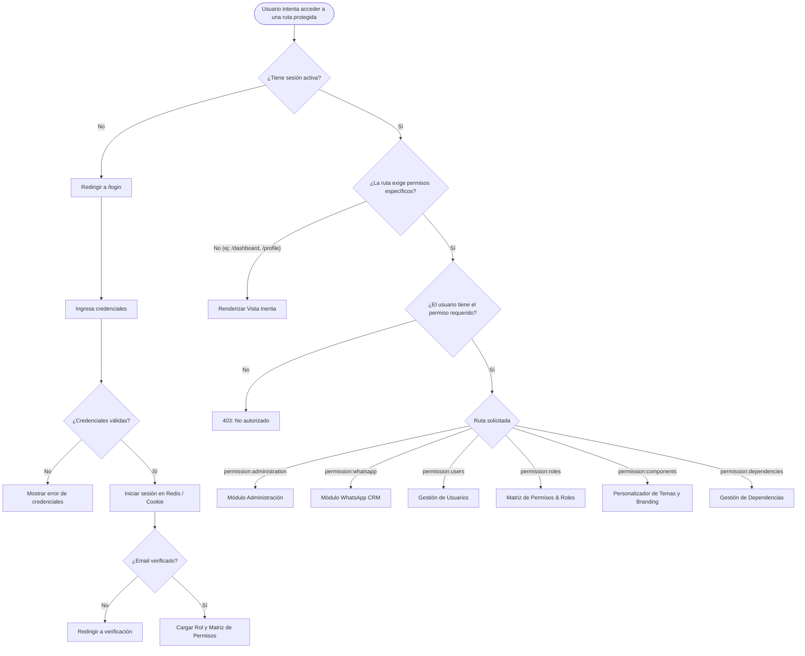
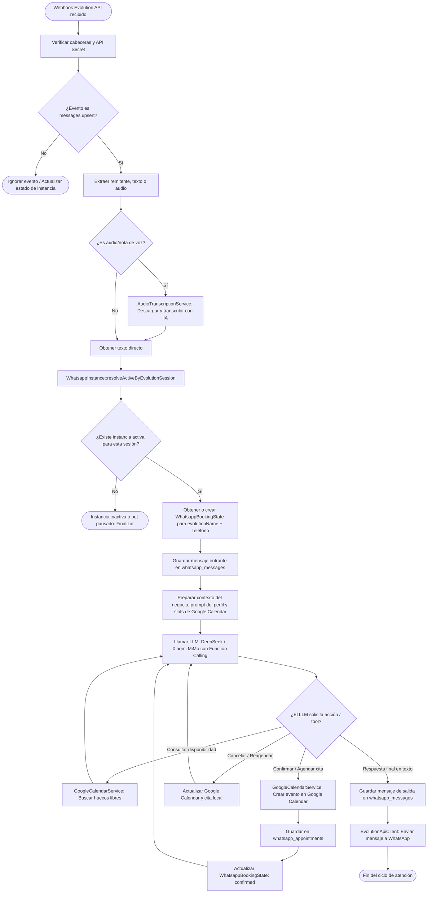
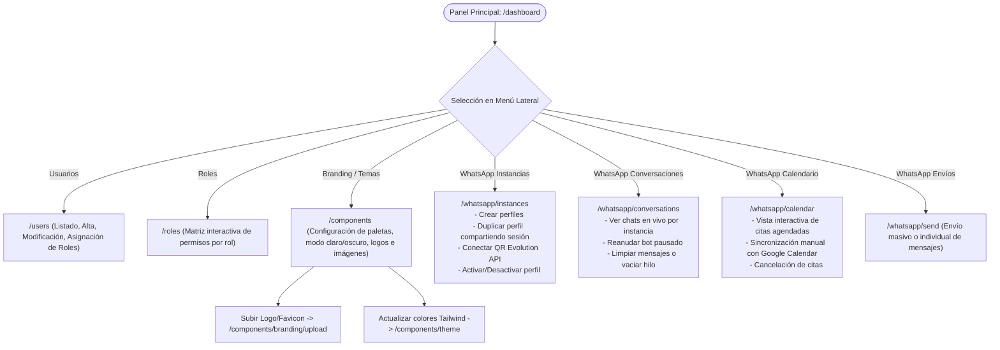
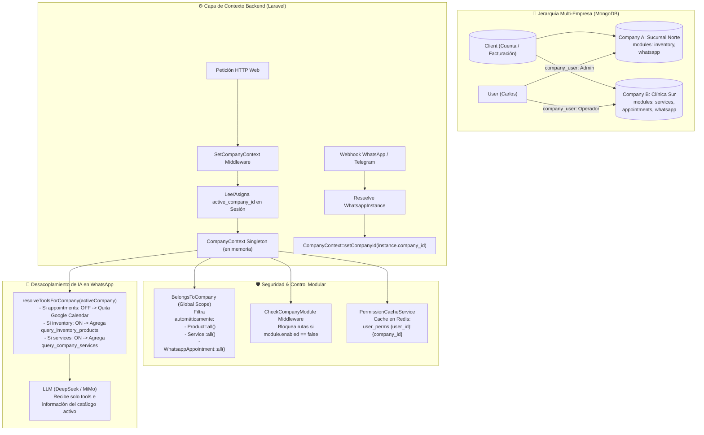

# Diagramas de Flujo del Sistema — Base Sistema

Este documento contiene todos los diagramas de flujo y arquitectura detallada del sistema **Base Sistema** (Laravel 12, Vue 3 Inertia SSR, MongoDB, Redis, Reverb, Evolution API, Telegram Bot API, Google Calendar API y LLMs).

---

## Índice de Diagramas

1. [Arquitectura Global y Ciclo de Peticiones](#1-arquitectura-global-y-ciclo-de-peticiones)
2. [Flujo de Autenticación, Roles y Permisos](#2-flujo-de-autenticación-roles-y-permisos)
3. [Flujo del Bot de WhatsApp (Agendamiento de Citas)](#3-flujo-del-bot-de-whatsapp-agendamiento-de-citas)
4. [Flujo del Asistente de Telegram (Staff/Admin)](#4-flujo-del-asistente-de-telegram-staffadmin)
5. [Flujo de Notificaciones y WebSockets en Tiempo Real](#5-flujo-de-notificaciones-y-websockets-en-tiempo-real)
6. [Flujo de Navegación del Panel de Administración (Inertia + Vue 3)](#6-flujo-de-navegación-del-panel-de-administración)
7. [Arquitectura Multi-Empresa, Módulos y Contexto (SaaS)](#7-arquitectura-multi-empresa-módulos-y-contexto-saas)

---

## 1. Arquitectura Global y Ciclo de Peticiones

```mermaid
flowchart TD
    %% Entradas
    subgraph INGRESS ["🌐 Fuentes de Entrada"]
        ClientWeb["💻 Usuario Web / Admin (Navegador)"]
        ClientWA["📱 Cliente WhatsApp"]
        StaffTG["🤖 Staff / Admin Telegram"]
        ExtService["⚡ Eventos del Sistema (Jobs / Triggers)"]
    end

    %% Capa de Ruteo y Middleware
    subgraph GATEWAY ["🛡️ Capa de Ruteo & Seguridad (Laravel)"]
        WebRoutes["Web Routes (routes/web.php)"]
        AuthMiddleware{"¿Autenticado & Verificado?"}
        PermMiddleware{"¿Tiene Permiso Requerido?"}
        
        ApiRoutes["API Webhooks (routes/api.php)"]
        VerifyEvoSecret{"¿Firma Evolution Válida?"}
        VerifyTGSecret{"¿Firma Telegram Válida?"}
    end

    %% Capa de Controladores y Orquestadores
    subgraph CORE ["⚙️ Controladores & Orquestadores"]
        InertiaControllers["Controladores Web & Inertia
        (Users, Roles, Profile,
        Components, Dependencies,
        Whatsapp UI, Notifications)"]

        AppOrchestrator["AppointmentOrchestrator
        (Bot WhatsApp de Citas)"]

        AdminOrchestrator["AdminAssistantOrchestrator
        (Asistente Telegram Staff)"]

        NotifBroadcaster["Notification Link Resolver &
        Event Broadcaster (NotificacionToUser)"]
    end

    %% Capa de Servicios Externos
    subgraph EXTERNAL ["☁️ Servicios Externos e IA"]
        EvoAPI["Evolution API (Baileys / WhatsApp)"]
        TGBotAPI["Telegram Bot API"]
        LLM["IA LLM (DeepSeek / Xiaomi MiMo)"]
        GCalendar["Google Calendar API"]
        ReverbWS["Servidor Reverb (WebSockets :8080)"]
    end

    %% Capa de Persistencia y Caché
    subgraph STORAGE ["💾 Persistencia (MongoDB) & Caché (Redis)"]
        MongoUsers[("users & roles")]
        MongoWA[("whatsapp_instances
        whatsapp_messages
        whatsapp_booking_states
        whatsapp_appointments")]
        MongoNotif[("notifications")]
        MongoConfig[("component_themes
        dependencies")]
        RedisCache[("Redis (Sesiones / Cache / Queues)")]
    end

    %% Conexiones Web
    ClientWeb --> WebRoutes
    WebRoutes --> AuthMiddleware
    AuthMiddleware -- No --> LoginFlow["Redirección a /login"]
    AuthMiddleware -- Sí --> PermMiddleware
    PermMiddleware -- No --> Forbidden["403 Forbidden"]
    PermMiddleware -- Sí --> InertiaControllers
    InertiaControllers <--> MongoUsers & MongoConfig & MongoWA & MongoNotif & RedisCache
    InertiaControllers -->|Renderiza| VueInertia["Vue 3 + PrimeVue / SSR"]
    VueInertia --> ClientWeb

    %% Conexiones WhatsApp Inbound
    ClientWA -->|Envía mensaje| EvoAPI
    EvoAPI -->|POST /api/evolution/webhook| ApiRoutes
    ApiRoutes --> VerifyEvoSecret
    VerifyEvoSecret -- No --> DropEvo["401 Unauthorized / Ignorar"]
    VerifyEvoSecret -- Sí --> AppOrchestrator

    AppOrchestrator <--> MongoWA
    AppOrchestrator <--> LLM
    AppOrchestrator <--> GCalendar
    AppOrchestrator -->|Enviar respuesta| EvoAPI
    EvoAPI -->|Entrega mensaje| ClientWA

    %% Conexiones Telegram Inbound
    StaffTG -->|Comando / Consulta| TGBotAPI
    TGBotAPI -->|POST /api/telegram/{instance}/webhook| ApiRoutes
    ApiRoutes --> VerifyTGSecret
    VerifyTGSecret -- No --> DropTG["401 Unauthorized"]
    VerifyTGSecret -- Sí --> AdminOrchestrator

    AdminOrchestrator <--> MongoWA
    AdminOrchestrator <--> LLM
    AdminOrchestrator <--> GCalendar
    AdminOrchestrator -->|Respuesta bot| TGBotAPI
    TGBotAPI --> StaffTG

    %% Conexiones Notificaciones
    ExtService & InertiaControllers --> NotifBroadcaster
    NotifBroadcaster --> MongoNotif
    NotifBroadcaster -->|Broadcast Event| ReverbWS
    ReverbWS -->|WebSocket Push (Echo)| ClientWeb
```

---

## 2. Flujo de Autenticación, Roles y Permisos



---

## 3. Flujo del Bot de WhatsApp (Agendamiento de Citas)



---

## 4. Flujo del Asistente de Telegram (Staff/Admin)

```mermaid
flowchart TD
    A([Webhook Telegram recibido en /api/telegram/:instance/webhook]) --> B[Verificar X-Telegram-Bot-Api-Secret-Token]
    B --> C[Buscar WhatsappInstance por instance_name y telegram_bot_token]
    
    C --> D{¿Instancia y token válidos?}
    D -- No --> E401([401 / 404 No autorizado])
    
    D -- Sí --> E[Extraer chat_id, user_id y mensaje]
    E --> F{¿chat_id está autorizado en el perfil?}
    F -- No --> RejectMsg[Responder: 'Usuario no autorizado para este bot']
    
    F -- Sí --> G[Recuperar historial reciente de TelegramAdminMessage]
    G --> H[Determinar intención con LLM (Consultar citas, métricas, estado de instancias)]
    
    H --> I{Acción solicitada}
    I -->|Ver citas de hoy/semana| J[Consultar whatsapp_appointments y Google Calendar]
    I -->|Cambiar perfil activo| K[Activar nuevo perfil y desactivar hermanos de la misma sesión]
    I -->|Verificar estado WhatsApp| L[Consultar estado de conexión en Evolution API]
    I -->|Consulta general / Soporte| M[Generar respuesta asistida por IA]
    
    J & K & L & M --> N[Persistir mensaje en TelegramAdminMessage]
    N --> O[TelegramBotClient: sendMessage con teclado inline / formato Markdown]
    O --> P([Respuesta entregada al Staff])
```

---

## 5. Flujo de Notificaciones y WebSockets en Tiempo Real

```mermaid
flowchart TD
    EventTrigger([Acción en el sistema / Controlador / Job]) --> ResolveLinks[NotificationLinkResolver: Resuelve rutas Ziggy a URLs canónicas]
    
    ResolveLinks --> SaveMongo[Guardar documento en colección notifications:
    - user_id
    - message
    - item_ids
    - links: label + href
    - is_read: false]
    
    SaveMongo --> BroadcastEvent[Disparar evento NotificacionToUser en PrivateChannel: user.{id}]
    
    BroadcastEvent --> ReverbServer[Servidor Laravel Reverb WS :8080]
    ReverbServer --> EchoClient[Laravel Echo en el navegador del usuario]
    
    EchoClient --> ToastUI[Mostrar Toast interactivo con botones por cada link]
    EchoClient --> BadgeUI[Incrementar contador de campana: auth.notification_unread_count]
    
    subgraph PanelCampana ["Interactuación del Usuario con la Campana"]
        UserClickBell[Usuario abre Popover de Notificaciones]
        UserClickBell --> LazyFeed[GET /notifications/feed con VirtualScroller lazy]
        LazyFeed --> FilterChoice{Filtro seleccionado}
        FilterChoice -->|Todas| ShowAll[Listar notificaciones del mes]
        FilterChoice -->|No leídas| ShowUnread[Listar solo pendientes]
        
        UserAction{Acción del usuario}
        UserAction -->|Clic en enlace| MarkOne[PATCH /notifications/:id/read -> Navegar con Inertia]
        UserAction -->|Marcar todas| MarkAll[POST /notifications/mark-all-read]
    end
```

---

## 6. Flujo de Navegación del Panel de Administración



---

## 7. Arquitectura Multi-Empresa, Módulos y Contexto (SaaS)



