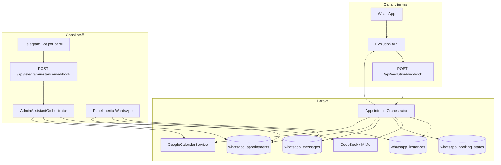

# Arquitectura técnica — WhatsApp Booking + Telegram Admin + Perfiles de negocio

Documento de referencia de lo implementado en este proyecto alrededor del bot de citas (WhatsApp/Evolution), el asistente admin (Telegram), perfiles de negocio compartiendo sesión, Google Calendar y políticas por instancia (p. ej. SAC).

**Stack:** Laravel (PHP 8.2+) · MongoDB · Inertia/Vue · Evolution API (Baileys) · DeepSeek / Xiaomi MiMo (OpenAI-compatible) · Google Calendar API · Telegram Bot API.

---

## 1. Vista general



Hay **dos canales de IA distintos**:

| Canal | Quién | Entrada | Orquestador | Persistencia clave |
|-------|--------|---------|-------------|-------------------|
| WhatsApp | Cliente final | Webhook Evolution | `AppointmentOrchestrator` | `evolutionName()` + teléfono |
| Telegram | Admin / staff | Webhook Telegram | `AdminAssistantOrchestrator` | `instance_name` del perfil + `chat_id` |

---

## 2. Modelo de “instancia” vs “sesión Evolution”

### 2.1 Conceptos

- **`instance_name`**: identificador del *perfil de negocio* en Mongo (UI, Telegram webhook path, permisos de menú). Ej.: `johan_test`, `SAC`.
- **`evolution_instance_name`**: nombre de la sesión en Evolution API (WhatsApp real + QR). Puede ser **compartido** entre varios perfiles.
- **`evolutionName()`** (`WhatsappInstance`): devuelve `evolution_instance_name` si existe; si no, `instance_name`.

### 2.2 Resolución del perfil activo (webhook WhatsApp)

Evolution siempre reporta el nombre de sesión (ej. `johan_test`). El orquestador **no** busca solo por `instance_name == payload`:

```text
WhatsappInstance::resolveActiveByEvolutionSession($evolutionName)
→ status = active AND evolutionName() === $evolutionName
```

Solo **un** perfil `active` por sesión Evolution. Al activar uno, `deactivateSiblingProfiles()` pone `inactive` a los hermanos de la misma sesión.

### 2.3 Duplicar perfil (`POST /whatsapp/instances/{id}/duplicate`)

Copia catálogo / prompt / Calendar / credenciales Google; **no** crea instancia nueva en Evolution.

| Campo copia | Valor típico |
|-------------|--------------|
| `instance_name` | Nuevo (ej. `SAC`) |
| `evolution_instance_name` | Sesión del origen (ej. `johan_test`) |
| `status` | `inactive` |
| Telegram | Opcional (`copy_telegram`); por defecto no (un token = un webhook) |
| Credenciales Google | Misma ruta de archivo (compartida) |

Al borrar un perfil, el JSON de Google **solo** se elimina si ningún otro documento lo referencia.

### 2.4 Clave de persistencia WhatsApp

Mensajes, booking state y citas locales del bot cliente usan **`sessionKey = evolutionName()`**, no el nombre del perfil UI. Así el historial sobrevive al cambiar de perfil activo (SAC ↔ Palma) sobre la misma sesión WA.

Conversaciones / calendario en el panel resuelven el perfil por `instance_name` en la URL y consultan datos con `evolutionName()`.

---

## 3. Flujo inbound WhatsApp

### 3.1 Ruta y seguridad

```text
POST /api/evolution/webhook
Middleware: VerifyEvolutionWebhookSecret
Header: X-Evolution-Secret === EVOLUTION_WEBHOOK_SECRET
```

### 3.2 `EvolutionWebhookController`

1. Filtra eventos ≠ `MESSAGES_UPSERT`.
2. Ignora `fromMe`, grupos, broadcast, newsletter.
3. Media sin texto → respuesta estática opcional (`WHATSAPP_AUTO_MEDIA_REPLY`).
4. Extrae `instance` + teléfono + texto.
5. Welcome opcional (`WHATSAPP_AUTO_WELCOME`).
6. `AppointmentOrchestrator::handleIncoming($instance, $phone, $text)`.

### 3.3 `AppointmentOrchestrator::handleIncoming`

1. Resuelve perfil activo por sesión Evolution.
2. Normaliza teléfono (`EvolutionApiClient::normalizePhone`).
3. Persiste mensaje user; si `bot_paused_at` → no responde (escalación).
4. `backfillMissingFromTranscript()` — recupera `name`/`service` si el LLM olvidó tool-calls.
5. Arma prompts:
   - **Estático:** reglas transversales + catálogo (`services`, `prices`, …) + `system_prompt` de la instancia.
   - **Dinámico:** fecha/hora, JSON de estado, recordatorio YA GUARDADO / AÚN FALTA, prompt de etapa.
6. Historial LLM: últimos `WHATSAPP_HISTORY_TURNS` (default **8**) turnos user.
7. Loop tool-calling (máx. ~3–4 rondas) con DeepSeek o MiMo según `ai_provider`.
8. Guards post-LLM: no afirmar cita confirmada sin `create_calendar_event` ok; completar resumen CONFIRMING.
9. Persiste assistant + `EvolutionApiClient::sendText(sessionKey, phone, reply)`.

---

## 4. Máquina de etapas (booking)

Modelo: `WhatsappBookingState`  
Colección: `whatsapp_booking_states`  
Clave: `(instance_name=sessionKey, user_phone)`.

| Etapa | Constante | Rol |
|-------|-----------|-----|
| Recepción | `RECEPTION` | Dudas / detectar intención |
| Recolección | `COLLECTING` | Pedir solo campos pendientes |
| Confirmación | `CONFIRMING` | Resumen + sí explícito |
| Completado | `COMPLETED` | Cita registrada |

Campos de embudo: `name`, `service`, `date`, `time`, `location`, `notes`, `intent`.  
Extras: `friction_count`, `bot_paused_at`, `escalation_reason`, `escalation_detail`.

`hasRequiredBookingData` = name + service + date + time llenos → auto-paso a `CONFIRMING` en `updateState`.

### 4.1 Anti-amnesia

Problema observado: tras varios `check_availability`, el historial corto + falta de `update_booking_state` hacía que el modelo volviera a pedir nombre/servicio.

Mitigaciones:

1. `WHATSAPP_HISTORY_TURNS=8`.
2. Bloque dinámico **YA GUARDADO / AÚN FALTA**.
3. Reglas transversales: al cambiar hora no usar `clear_fields` sobre name/service.
4. `backfillMissingFromTranscript`: infiere nombre tras “¿cómo te llamas?” y servicio solo desde frases tipo “agendar una consulta general” (ignora dumps de catálogo con ≥3 servicios).

### 4.2 Borrado de conversación (panel)

Antes: borrar mensajes **no** limpiaba booking → el prompt dinámico seguía “recordando”.

Ahora:

- `destroyThread`: borra mensajes (sesión + alias de perfil) + `resetBookingFields`.
- `destroyInstanceMessages`: borra todos los mensajes de la sesión + `resetAllForInstance`.

Borrar el chat en el teléfono **no** limpia Mongo.

---

## 5. Tools del bot WhatsApp (LLM)

Definidas en `HasWhatsappBookingTools`; ejecutadas en `AppointmentOrchestrator::executeToolCall`.

| Tool | Propósito | Salvaguardas |
|------|-----------|--------------|
| `update_booking_state` | Persistir embudo | No vaciar name/service al actualizar solo fecha/hora |
| `check_availability` | Libre/ocupado (local + Google) | Si ocupado: `next_slots`; política extra solo si `slot_busy_policy` |
| `create_calendar_event` | Alta cita 30 min default | Exige etapa CONFIRMING + `client_confirmed=true` |
| `list_my_appointments` | Citas futuras de **este** teléfono | No inventar |
| `cancel_appointment` | Baja sistema + Google | Solo dueño del teléfono + `client_confirmed=true` + id exacto |
| `reset_booking` | Limpia embudo → RECEPTION | **No** borra citas de calendario |
| `escalate_to_human` | Pausa bot + notifica staff | Respuesta de cortesía; no decir “te transfiero” |

### 5.1 Disponibilidad y `next_slots`

Si el slot está ocupado (conflicto local y/o Google busy):

- `available: false`, `reason: slot_busy|google_busy`.
- Mensaje global: “ya hay una cita agendada” + sugerencias `next_slots` (búsqueda en adelante por bloques de duración del slot, tipicamente 30 min).
- **No** se menciona urgencia/costo extra en el mensaje global.

Si Google falla y local está libre: `verify_uncertain` → no afirmar libre.

### 5.2 Política por instancia: `slot_busy_policy`

Campo opcional en `whatsapp_instances`. Si está definido, se concatena al mensaje de la tool:

```text
Política de esta instancia: …
```

Ejemplo **solo SAC**:

> Si el cliente necesita ir justo en ese horario: URGENCIA con COSTO EXTRA… Si acepta, `service=Urgencias`.

Otras instancias (p. ej. Palma / `johan_test`) no tienen el campo → no reciben esa lógica.

### 5.3 Cancelación precavida

Flujo obligatorio en prompts:

1. `list_my_appointments`
2. Mostrar opciones
3. Pedir SÍ explícito sobre servicio + fecha/hora
4. `cancel_appointment` con `client_confirmed=true` e `appointment_id`
5. Match de teléfono dueño; log de auditoría; reset embudo tras OK

### 5.4 Escalación a staff

`notifyStaffEscalation`:

1. Notificación in-app + evento realtime a usuarios con permisos `whatsapp*`.
2. Opcional WhatsApp a `WHATSAPP_ESCALATION_PHONE` vía Evolution.
3. Broadcast Telegram a `telegram_allowed_user_ids` del perfil (si hay token).

---

## 6. Google Calendar

`GoogleCalendarService`:

- `createEvent` / `deleteEvent` / `listEvents` / `hasBusyConflict` (freebusy + fallback list).
- `syncInstanceFromGoogle` → upsert en `whatsapp_appointments` con `instance_name = evolutionName()`.
- Credenciales: JSON service account por instancia (`google_credentials_path`), Calendar ID en el documento.

Alta desde bot:

1. Conflicto local/Google → no crear; friction; posible escalado.
2. Crear documento local `source=bot`.
3. Insert Google; actualizar `google_event_id`, `sync_status`.

Duración default de cita: **30 minutos** si no hay `end_iso`.

---

## 7. Proveedores LLM

| Provider | Cliente | Config |
|----------|---------|--------|
| `deepseek` | `DeepSeekClient` | `services.deepseek.*` |
| `mimo` | `MimoClient` | `services.mimo.*` (thinking disabled; timeout HTTP elevado) |

Interfaz: `LlmChatClient::chat($messages, $withTools, $tools = null)`.  
WhatsApp usa tools de booking; Telegram admin pasa `adminTools()`.

---

## 8. Telegram — asistente admin por perfil

### 8.1 Config por instancia

| Campo | Uso |
|-------|-----|
| `telegram_bot_token` | Token BotFather (oculto en serialización UI) |
| `telegram_bot_username` | De `getMe` |
| `telegram_webhook_secret` | Validación `X-Telegram-Bot-Api-Secret-Token` |
| `telegram_link_code` | `/start CÓDIGO` vincula user id |
| `telegram_allowed_user_ids` | Lista de user ids autorizados |

Webhook:

```text
POST /api/telegram/{instance_name}/webhook
Middleware: VerifyTelegramWebhookSecret (secret del documento)
```

URL registrada: `{TELEGRAM_WEBHOOK_BASE_URL|APP_URL}/api/telegram/{instance}/webhook`.

### 8.2 `AdminAssistantOrchestrator`

- Auth: `/start` + código, o ids permitidos.
- Historial: `telegram_admin_messages` (`instance_name` perfil + `chat_id`).
- Tools admin: `list_appointments`, `agenda_occupancy`, `list_packages`, `block_availability`, `cancel_appointment`, `get_business_info`.
- Citas/bloqueos usan `evolutionName()` para alinear con la agenda de la sesión WA.
- `provisionBot()`: genera secret/código, `setWebhook`, guarda username.

UI: pestaña **Telegram** en Instancias (token, ids, re-registrar webhook, regenerar código, quitar bot).

---

## 9. Panel web (Inertia)

Permisos (seeders WhatsApp): `whatsapp`, `whatsapp.instances`, `whatsapp.conversations`, `whatsapp.calendar`, `whatsapp.send`.

| Módulo | Capacidad |
|--------|-----------|
| Instancias | CRUD, QR Evolution, duplicar, Telegram, catálogo, IA |
| Conversaciones | Hilos por sesión, borrar hilo/todo, reanudar bot |
| Calendario | Listar/sync/borrar citas |
| Enviar | Texto de prueba vía Evolution |

---

## 10. Colecciones Mongo relevantes

| Colección | Contenido |
|-----------|-----------|
| `whatsapp_instances` | Perfil negocio + Evolution + Calendar + Telegram + `slot_busy_policy` |
| `whatsapp_messages` | Transcript LLM cliente (`instance_name` = sessionKey) |
| `whatsapp_booking_states` | Embudo + pausa |
| `whatsapp_appointments` | Citas locales / sync Google |
| `telegram_admin_messages` | Transcript admin Telegram |

---

## 11. Variables de entorno (messaging)

```env
EVOLUTION_BASE_URL=
EVOLUTION_API_KEY=
EVOLUTION_WEBHOOK_SECRET=
EVOLUTION_WEBHOOK_URL=

DEEPSEEK_API_KEY=
DEEPSEEK_BASE_URL=
DEEPSEEK_MODEL=
DEEPSEEK_MAX_TOKENS=

MIMO_API_KEY=
MIMO_BASE_URL=
MIMO_MODEL=

WHATSAPP_HISTORY_LIMIT=15
WHATSAPP_HISTORY_TURNS=8
WHATSAPP_AUTO_WELCOME=false
WHATSAPP_AUTO_MEDIA_REPLY=false
WHATSAPP_FRICTION_ESCALATE_AFTER=3
WHATSAPP_ESCALATION_PHONE=
WHATSAPP_ESCALATION_INSTANCE=

GOOGLE_CALENDAR_ID=
GOOGLE_SERVICE_ACCOUNT_PATH=
GOOGLE_CALENDAR_TIMEZONE=

TELEGRAM_WEBHOOK_BASE_URL=   # vacío → APP_URL
TELEGRAM_ADMIN_HISTORY_LIMIT=12
TELEGRAM_ADMIN_HISTORY_TURNS=4
```

Config central: `config/services.php` (`evolution`, `whatsapp`, `deepseek`, `mimo`, `google_calendar`, `telegram`).

---

## 12. Archivos clave

```text
routes/api.php
routes/web.php

app/Http/Controllers/Api/EvolutionWebhookController.php
app/Http/Controllers/Api/TelegramWebhookController.php
app/Http/Controllers/Whatsapp/InstancesController.php
app/Http/Controllers/Whatsapp/ConversationsController.php
app/Http/Controllers/Whatsapp/CalendarController.php
app/Http/Controllers/Whatsapp/MessagesController.php

app/Http/Middleware/VerifyEvolutionWebhookSecret.php
app/Http/Middleware/VerifyTelegramWebhookSecret.php

app/Models/WhatsappInstance.php
app/Models/WhatsappMessage.php
app/Models/WhatsappBookingState.php
app/Models/WhatsappAppointment.php
app/Models/TelegramAdminMessage.php

app/Services/Whatsapp/AppointmentOrchestrator.php
app/Services/Whatsapp/BookingStateRepository.php
app/Services/Whatsapp/ConversationRepository.php
app/Services/Whatsapp/EvolutionApiClient.php
app/Services/Whatsapp/GoogleCalendarService.php
app/Services/Whatsapp/DeepSeekClient.php
app/Services/Whatsapp/MimoClient.php
app/Services/Whatsapp/Concerns/HasWhatsappBookingTools.php

app/Services/Telegram/AdminAssistantOrchestrator.php
app/Services/Telegram/TelegramBotClient.php
app/Services/Telegram/AdminConversationRepository.php
app/Services/Telegram/Concerns/HasAdminAssistantTools.php

resources/js/Pages/Whatsapp/Instances/Index.vue
resources/js/Pages/Whatsapp/Conversations/*
resources/js/Pages/Whatsapp/Calendar/*
```

---

## 13. Políticas de negocio por instancia (contenido)

El comportamiento “de marca” vive en campos de texto del documento `whatsapp_instances`, **no** en código hardcodeado (salvo infraestructura genérica):

| Campo | Rol |
|-------|-----|
| `business_name` | Nombre en prompts |
| `services` / `prices` / `business_hours` / `locations` / `promotions` | Catálogo inyectado |
| `system_prompt` | Políticas adicionales (embudo, tono, FAQs) |
| `slot_busy_policy` | Extra solo en tool de disponibilidad |
| `ai_provider` | `deepseek` \| `mimo` |
| `timezone` | Parsing de fechas / Calendar |

### 13.1 Palma (`johan_test`)

Embudo fotográfico: pedir fecha + zona + personas antes de cotizar; zonas estándar vs foráneas (escalar); sin confirmación falsa de cita.

### 13.2 SMALL Animal Clinic (`SAC`)

- Previa cita (30 min) vs urgencias 24/7 sin cita.
- Vacunas = fuera de catálogo (no usar frase de “fuera de tema” genérica).
- Sin oxígeno; maps solo al confirmar llegada / pedir dirección / retractarse.
- Emojis solo saludo y confirmación de cita.
- Horario ocupado → cita existente + siguiente turno; urgencia+extra vía `slot_busy_policy` + prompt.

Ambos perfiles pueden compartir `evolution_instance_name = johan_test`; solo el `active` atiende el webhook.

---

## 14. Contratos de seguridad / consistencia

1. Un perfil `active` por sesión Evolution.
2. Confirmación de cita / cancelación exige tool `ok` + `client_confirmed` donde aplica.
3. Cancelación WhatsApp solo sobre citas del mismo `user_phone`.
4. Webhooks Evolution/Telegram con secret.
5. Token Telegram nunca expuesto completo en la UI (hint).
6. Políticas sensibles de negocio (urgencia, anticipos, CLABE) en datos de instancia, no en reglas globales del orquestador.

---

## 15. Riesgos operativos y mitigaciones

### 15.1 Race conditions (ráfagas de mensajes)

**Riesgo:** Evolution puede entregar 3–4 mensajes HTTP en paralelo; dos `AppointmentOrchestrator` podrían mutar el mismo `whatsapp_booking_states` y enviar respuestas duplicadas.

**Mitigación implementada:**
- `Cache::lock("wa:process:{session}:{phone}")` serializa el procesamiento por teléfono.
- Append del mensaje de usuario **antes** del lock (no se pierde).
- Debounce por watermark Redis (`wa:burst:…`, `WHATSAPP_BURST_DEBOUNCE_MS`, default 2500 ms): solo el último mensaje de la ráfaga genera respuesta; el resto queda en el historial LLM.
- Config: `WHATSAPP_PROCESS_LOCK_SECONDS`, `WHATSAPP_PROCESS_LOCK_WAIT_SECONDS`.
- **Cache store:** `CACHE_STORE=redis` (servicio `redis` en `compose.yaml`, DB `REDIS_CACHE_DB=1`). Locks multi-worker son globales vía Redis.

**Pendiente / opcional:** cola `ShouldBeUnique` + job diferido si se sale de `QUEUE_CONNECTION=sync`.

### 15.2 Double booking (mismo slot, dos clientes)

**Riesgo:** Ambos pasan `check_availability` como libre antes de que alguno confirme.

**Mitigación implementada:**
- Soft-hold al entrar / permanecer en `CONFIRMING` con `date`+`time`: campos `slot_hold_starts_at`, `slot_hold_ends_at`, `slot_hold_expires_at` (TTL `WHATSAPP_SLOT_HOLD_MINUTES`, default 10).
- `check_availability` / `create_calendar_event` / sugerencia de siguientes slots consultan holds activos de **otros** teléfonos.
- Se libera al `reset`, al completar cita (`markCompleted`) o al salir de CONFIRMING sin fecha/hora.

### 15.3 Dependencia Baileys / Evolution

**Riesgo:** Emulación web → baneos, desconexiones QR, inestabilidad a volumen alto.

**Mitigación implementada:**
- Contrato `App\Services\Whatsapp\Contracts\MessengerGatewayInterface` (`sendText`, `sendTyping`, `normalizePhone`).
- Binding en `AppServiceProvider` → `EvolutionApiClient` hoy; se puede registrar un adaptador Meta Cloud API sin reescribir el orquestador.
- Controllers de panel (QR, instancias) siguen tipados a Evolution (API específica); el flujo de chat cliente usa el gateway.

### 15.4 Latencia de tool-calling

**Riesgo:** 3–4 rondas LLM síncronas → 5–8+ s de silencio percibido.

**Mitigación implementada:**
- Tras adquirir el lock y pasar el debounce, se llama `MessengerGatewayInterface::sendTyping` → Evolution `POST /chat/sendPresence/{instance}` con `presence=composing` (best-effort; fallos no tumban el flujo).

---

## 16. Operación rápida

| Acción | Cómo |
|--------|------|
| Activar SAC sobre la misma WA | Status SAC=`active` (desactiva hermanos de la sesión) |
| Probar prompt limpio | Panel → Conversaciones → borrar hilo (limpia msgs + state) |
| Vincular admin Telegram | Token en instancia → registrar webhook → `/start {link_code}` |
| Ver por qué no responde | `storage/logs/laravel.log`: inactive, MiMo timeout, bot_paused, burst debounce, process lock |
| Sync Calendar | Panel Calendario → Sync o comando Artisan de sync |
| Ajustar debounce / hold | `.env`: `WHATSAPP_BURST_DEBOUNCE_MS`, `WHATSAPP_SLOT_HOLD_MINUTES` |

---

*Documento generado como resumen técnico del trabajo de mensajería, perfiles duplicados, Telegram admin, anti-amnesia de embudo, cancelación segura, políticas por instancia (SAC), y mitigaciones de concurrencia / soft-hold / gateway / composing.*
